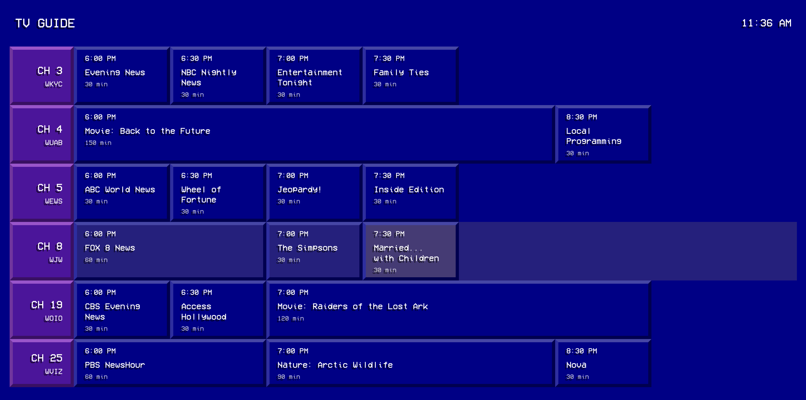

# Channel Surfer

A retro 90's style video streaming server with a nostalgic TV Guide interface.



## Description

Channel Surfer combines a Node.js Express server for video delivery with a React-based frontend using Vite. It also includes Rust components for enhanced functionality. The interface is inspired by the classic 90's cable TV guide channels that many of us grew up with - complete with scrolling listings, retro fonts, and that distinctive blue/yellow color scheme.

## Features

- Video streaming from local library
- Authentic 90's TV Guide-inspired interface for browsing content
- Period-appropriate design elements including pixelated graphics and nostalgic typography
- Responsive design with Tailwind CSS that maintains the retro feel
- Express backend for serving video files

## Technologies

- **Core Backend**: Rust (primary application logic and performance-critical components)
- **Web Server**: Node.js, Express (for serving video content)
- **Frontend**: React, Vite, Tailwind CSS

## Design Inspiration

The visual design takes heavy inspiration from cable TV guide channels of the 1990s. Key nostalgic elements include:

- The iconic blue background with yellow text for channel listings
- Scrolling program information reminiscent of cable systems
- Pixelated UI elements and retro typography
- CRT screen effects for that authentic vintage television experience

## Installation

1. Clone the repository:
   ```
   git clone https://github.com/yourusername/channel-surfer.git
   cd channel-surfer
   ```

2. Install dependencies:
   ```
   npm install
   ```

3. If using Rust components, build them:
   ```
   cargo build
   ```

## Usage

1. Start the development server:
   ```
   npm run dev
   ```

2. For production, build and serve:
   ```
   npm run build
   node server.js
   ```

3. Access the application at:
   ```
   http://localhost:3000
   ```

## Project Structure

- `/frontend/` - React application
- `/src/` - Rust source code
- `/videos/` - Media files location
- `server.js` - Express server for video delivery

## Contributing

Contributions are welcome! Please feel free to submit a Pull Request.

## License

This project is licensed under the MIT License - see the LICENSE file for details.
